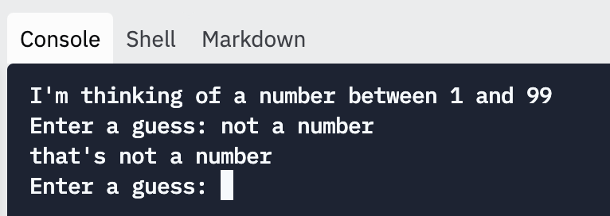

# Guess My Number

In this project, you'll build a number guessing game.

The program will set a hidden number, and the user will try to guess what it is. The program will tell them if their guess is too high or too low, and it will stop and congratulate them when they eventually guess the number correctly.

## Expected Results

Here's a snapshot of what a full game might look like:


Or like this, with another number:

```
I'm thinking of a number between 1 and 99
Enter a guess: 45
Your guess is too high
Enter a guess: 25
Your guess is too high
Enter a guess: 10
Your guess is too low
Enter a guess: 18
Your guess is too high
Enter a guess: 14
Your guess is too low
Enter a guess: 16
Your guess is too high
Enter a guess: 15
Congrats! The number was 15
```

There are no unit tests, so you'll have to check for yourself if the program is working.

## Your Task
### Part 1: High or Low

To start:

1. Assign a secret number variable. Just pick a number for now.
2. Prompt the user to enter a number
3. Using `if`, `elif`, and `else`, print an appropriate message based on the user's guess. Let them know if their guess is too low, too high, or correct.

Run your program to confirm that it's working. Be sure to try out numbers that are higher, lower, and equal to the secret number.

### Part 2: Loop

Now that you have the conditional logic working, you can make the rest of the game work.

1. Add a `while` loop around your code that prompts for the guess and checks the guess. (Be sure to fix the indentation to put the `if` / `elif` / `else` blocks inside the `while` loop.)
2. Add a `break` statement after the user guesses the correct value.
3. Import the `random` library, and use `random.randint()` to set your secret number.

Test your game again, to make sure that it works as you expect.

### Protect from errors

If the user enters a guess that isn't a number, the game should warn them and continue, instead of exiting with an error. You can use `str.isdecimal` to check that a string contains only decimal numbers.

Be sure to run your program again to confirm that it still works after adding this feature.

